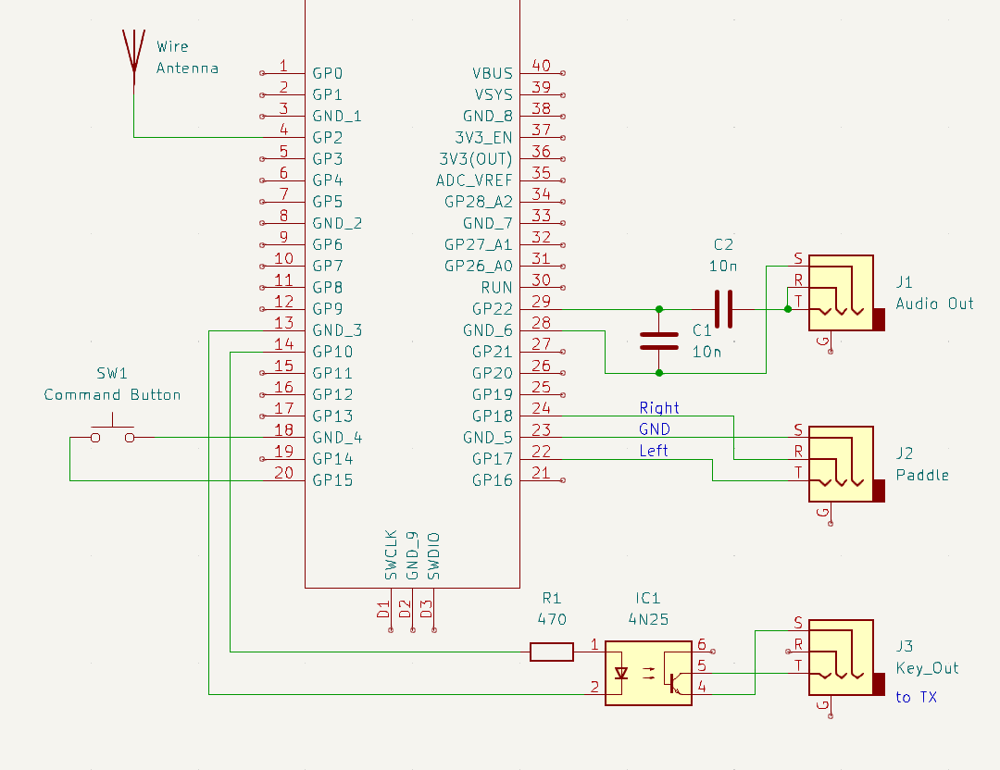

# iambic keyer

* Version 6.1.2024 fix tx_enable json file 

IAMBIC keyer in micropython
* Iambic Mode A/B
* command function over keyer 
* Transmit by sound (headphone)
* Transmit by LED
* Transmit by optocoupler
* Transmit by HF -> transceiver on board  


profession Version :-)


It is a minimalist device based on the micropython `code`  installed on rp2040 with Thonny Tool.

No `pcb` board, simply solder connectors directly on rp2040, and/or assemble it in a box

## Features

Command

Hit the command button and use a morse letter. The definition is copy from kn3g keyer, which I have been using for 5 years 

* a -> Iambic Mode A
* b -> Iambic Mode B
* m -> request Iambic Mode A/B

* ? -> request value of ...

* i -> TX_opt enable(on) disable(off)
* j -> TX_transceiver enable(on) disable(off)
* o -> Sidetone toggle (on) (off)

* f -> adjust sidetone frequency
* v -> adjust sidetone volume 1-100
* q -> adjust qrg of tx
* w -> adjust WPM (words per minute)

* t -> tune mode, end with command mode
* s -> save parameter to  file

* x -> exit command mode

## simple HF transceiver
On rp2040 pin toggle with 7.xxx xxx MHz 

```
simple code
def tx_toggle():
        wrap_target()
        set(pins, 1) [1]
        set(pins, 0) [1]
        wrap()
```
you can receive the cw signal on qrg:
| Freq                         |
| -----------------------------|
| 7029870 |
| 7023700 |
| 7017540 |
| 7011390 |
| 7005250 |
 

## Software Installation

1. Install Thonny on your PC/MAC 
https://projects.raspberrypi.org/en/projects/getting-started-with-the-pico/2
2. connect to a Raspberry Pi Pico on USB
3. copy imabic_keyer_rp2040.py and json_iambic.json to rp2040
4. open the file imabic_keyer_rp2040.py and test the keyer
5. when everything works as intended, save the program as main.py

6. if the  json file is wrong, you can start in factorymode (hold command button while booting)


## Configuration
Main parameters are set up in json file.
You can change the parameters in command mode of the keyer, or edit the json.txt file.  
```
 "{
 \"txt_emable\": 0,
 \"sidetone_volume\": 10,
 \"sidetone_freq\": 700,
 \"sidetone_enable\":1,
 \"tx_enamble\": 0,
 \"iambic_mode\": 16,
 \"wpm\": 18
}"
```
## Pinout

Setup Hardware pin on rp2040
```
comand_button    = 15 
onboard_led      = 25 
extern_led       = 11 
tx_opt_pin       = 10 


cw_sound_pin     = 22
paddle_left_pin  = 17 
paddle_right_pin = 18
```


## Assembly and Bill of Materials


KIS -> keep it simple

* J2 2.5mm  jack (for keyer, headphone)
* optocoupler for connecting the transceiver
* button for command mode
* option for external command led

## Future

Some Ideas / options on demand:

* power save mode
* wpm control with potentiometer

## References

* MarkWoodworth xiaokey https://github.com/MarkWoodworth/xiaokey
* Cornell University ECE4760 RP2040 testing http://people.ece.cornell.edu/land/courses/ece4760/RP2040/index_rp2040_testing.html 
* Iambic Morse Code Keyer Sketch Copyright (c) 2009 Steven T. Elliott https://github.com/sergev/vak-opensource/blob/master/hamradio/arduino-keyer.c
